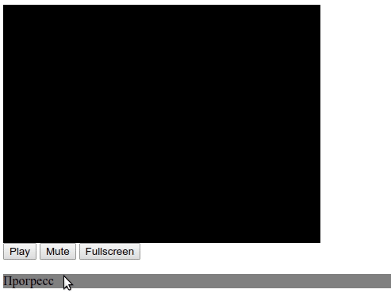

<!-- Плеер будет создан с задержкой, после того как загрузятся все ресурсы на странице. Для этого используется событие `DOMContentLoaded`. Благодаря этой особенности можно вызывать функцию `createPlayer` раньше, чем загрузятся все необходимые библиотеки: jQuery и Playable.
 -->

# Библиотека для создания видеоплеера

Минимальный набор инструментов, который нужен для создания своего видеоплеера. Все элементы можно кастомизировать на свой вкус и цвет.



Построен на базе библиотеки [Playable](https://wix.github.io/playable/).

## Примеры

Два рабочих примера:

- Страница с минимальными настройками — [example_min.html](./example_min.html)
- Страница с максимальными настройками — [example_max.html](./example_max.html)

## Как подключить

JS код поставляется в виде одного файла `player.js`, который нужно скачать из этого репозитория. Для работы он требует двух библиотек - [jQuery](https://jquery.com/) и [Playable](https://wix.github.io/playable/). Пример подключения в браузере:

```html
<script src="https://code.jquery.com/jquery-3.4.1.min.js"></script>
<script src="https://unpkg.com/playable@2.10.3/dist/statics/playable.bundle.min.js"></script>
<script src="player.js"></script>
```

Для работы библиотека требует HTML разметки. Вот полный пример с минимальным количеством настроек:

```html
<div id="player" style="width: 800px; height: 600px;">
    <div class="js-video-container" style="width: 100%; height: 100%"></div>
</div>

<script src="https://code.jquery.com/jquery-3.4.1.min.js"></script>
<script src="https://unpkg.com/playable@2.10.3/dist/statics/playable.bundle.min.js"></script>
<script src="player.js"></script>

<script type="text/javascript">
  createPlayer({elementId: 'player'});
</script>
```

Этот код добавит на страницу плеер, который играет видео по [этой ссылке](https://dvmn.org/media/filer_public/78/db/78db3456-3fd3-4504-9ed9-d2d1fd843c0b/highest_peak.mp4).

Если хочется выбрать другое видео, с помощью аргумента `src` плееру можно указать какое видео проигрывать, ссылки обязаны заканчиваться расширением файла:

```html
<script type="text/javascript">
  createPlayer({
    elementId: 'player',
    src: 'https://dvmn.org/media/filer_public/d0/16/d016d9b8-4180-4bb9-ad83-0241f61627b8/samsung_demo_-_alive_in_color.mp4'
});
</script>
```

**Скрипт `player.js` нужно подключать строго после `<div>` с указанным elementId**

## Как подключить кнопки

**Внутри элемента с указанным `elementId` плеер ищет теги с классами:**

`js-video-container` — тег, внутри которого будет размещено само видео. Такой элемент обязательно должен присутствовать в вёрстке, без него не заведётся.

`js-play-button` — кнопка запуска видео-плеера. Автоматически скрывается в момент остановки видео — тег получает атрибут [hidden](https://developer.mozilla.org/ru/docs/Web/HTML/%D0%9E%D0%B1%D1%89%D0%B8%D0%B5_%D0%B0%D1%82%D1%80%D0%B8%D0%B1%D1%83%D1%82%D1%8B/hidden).

`js-pause-button` — кнопка паузы видео-плеера. Автоматически скрывается в момент инициализации плеера — тег получает атрибут [hidden](https://developer.mozilla.org/ru/docs/Web/HTML/%D0%9E%D0%B1%D1%89%D0%B8%D0%B5_%D0%B0%D1%82%D1%80%D0%B8%D0%B1%D1%83%D1%82%D1%8B/hidden). Кнопка появляется снова после начала воспроизведения видео. Чтобы кнопка не мерцала в момент загрузки страницы можно её вручную скрыть, добавив атрибут `hidden`:

```html
<button class="js-pause-button" hidden>Pause</button>
```

`js-mute-button` — кнопка, которая выключает звук плеера. По нажатию перестаёт играть звук в плеере. Автоматически скрывается при выключении звука — тег получает атрибут [hidden](https://developer.mozilla.org/ru/docs/Web/HTML/%D0%9E%D0%B1%D1%89%D0%B8%D0%B5_%D0%B0%D1%82%D1%80%D0%B8%D0%B1%D1%83%D1%82%D1%8B/hidden).

`js-volume-button` — кнопка которая включает звук. По нажатию начинает играть звук в плеере. Автоматически скрывается при включении звука — тег получает атрибут [hidden](https://developer.mozilla.org/ru/docs/Web/HTML/%D0%9E%D0%B1%D1%89%D0%B8%D0%B5_%D0%B0%D1%82%D1%80%D0%B8%D0%B1%D1%83%D1%82%D1%8B/hidden). Чтобы кнопка не мерцала в момент загрузки страницы можно её вручную скрыть, добавив атрибут `hidden`:

```html
<button class="js-volume-button" hidden>Volume</button>
```

`js-fullscreen-button` — кнопка включает полноэкранный режим.

`js-current-time` — внутри тега отобразится текущее время видеозаписи.

`js-duration` — внутри тега отобразится общая продолжительность видеозаписи.

`.js-progress` и `js-progress-slider` — комбинация из двух тегов для отображения ползунка видео-плеера. Он показывает какая часть видео была просмотрена и позволяет быстро промотать на интересный момент ролика. Нужны два тега, один внутри другого. Внешний тег отвечает за перетаскивание ползунка — перехватывает клики мышкой. Внутренний блок отображает прогресс — заполняет слайдер. Пример вёрстки:

```html
<div class="js-progress" style="background-color: grey;">
  <div class="js-progress-slider" style="background-color: red;">Прогресс</div>
</div>
```
